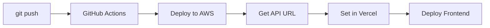

# Deployment Guide

This repository uses a **monorepo** structure - both frontend and backend are deployed from the same repository.

## Architecture

```
GitHub Repo (customer-care-ai)
    │
    ├──► GitHub Actions ──► AWS (Lambda + API Gateway)
    │
    └──► Vercel ──► Static Frontend
```

---

## 1️⃣ Deploy Backend to AWS (Automatic)

**Triggered by:** Push to `main` branch

**.github/workflows/deploy.yml** automatically:
1. Runs unit tests
2. Builds with AWS SAM
3. Deploys Lambda functions to AWS
4. Creates API Gateway endpoints

### Manual Deploy (Optional)
```bash
sam build --use-container
sam deploy --config-env dev
```

---

## 2️⃣ Deploy Frontend to Vercel

### Step 1: Connect Repository to Vercel

1. Go to [vercel.com](https://vercel.com)
2. Click "New Project"
3. Import your GitHub repository: `customer-care-ai`

### Step 2: Configure Vercel

**Root Directory:** `frontend`

**Build Settings:**
- Framework Preset: `Other` (static site)
- Build Command: (leave empty)
- Output Directory: `.` (current directory)

### Step 3: Set Environment Variable

In Vercel Dashboard → Settings → Environment Variables:

| Name | Value |
|------|-------|
| `API_URL` | `https://YOUR-API-ID.execute-api.us-east-1.amazonaws.com/dev/chat` |

Get the API URL from AWS after backend deployment:
```bash
aws cloudformation describe-stacks \
  --stack-name customer-care-ai-dev \
  --query 'Stacks[0].Outputs[?OutputKey==`ApiEndpoint`].OutputValue' \
  --output text
```

### Step 4: Deploy

Click **Deploy** - Vercel will automatically deploy from the `frontend/` folder.

---

## Environment Variables

### Vercel (Frontend)
- `API_URL` - AWS API Gateway endpoint

### AWS Lambda (Backend)
- `BEDROCK_MODEL_ID` - Claude model ID (set in template.yaml)
- `LOG_LEVEL` - Logging level (default: INFO)

---

## Testing

### Local Development
```bash
# Terminal 1: Start local server (for testing)
cd frontend && python server.py

# Terminal 2: Open browser
open http://localhost:5001
```

### Production
- **Frontend**: https://your-app.vercel.app
- **Backend**: https://xxx.execute-api.us-east-1.amazonaws.com/dev

---

## File Structure

```
customer-care-ai/
├── .github/workflows/
│   └── deploy.yml           ← AWS deployment
│
├── frontend/                ← Vercel deploys this folder
│   ├── index.html
│   ├── styles.css
│   ├── app.js
│   └── vercel.json
│
├── functions/               ← Lambda functions
├── layers/                  ← Shared code
└── template.yaml            ← SAM template
```

---

## Workflow



1. Push code to GitHub
2. GitHub Actions deploys Lambda to AWS
3. Copy API Gateway URL from AWS
4. Paste URL in Vercel environment variables
5. Redeploy frontend on Vercel (if needed)
