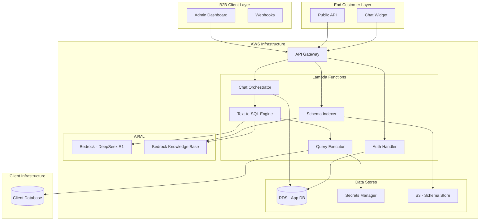
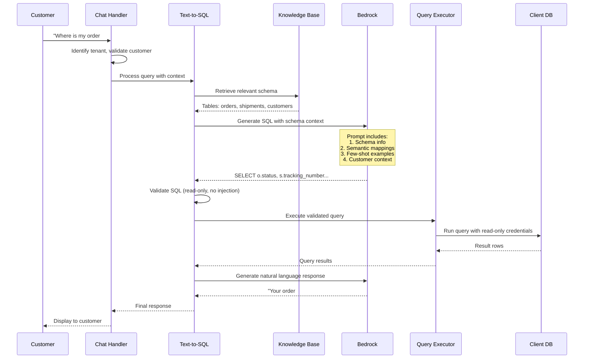
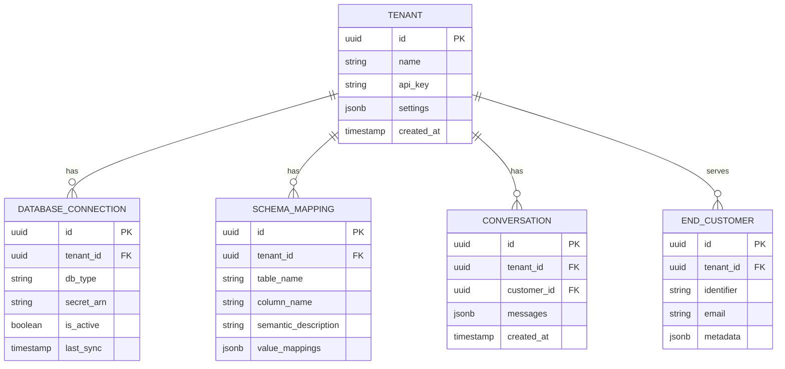
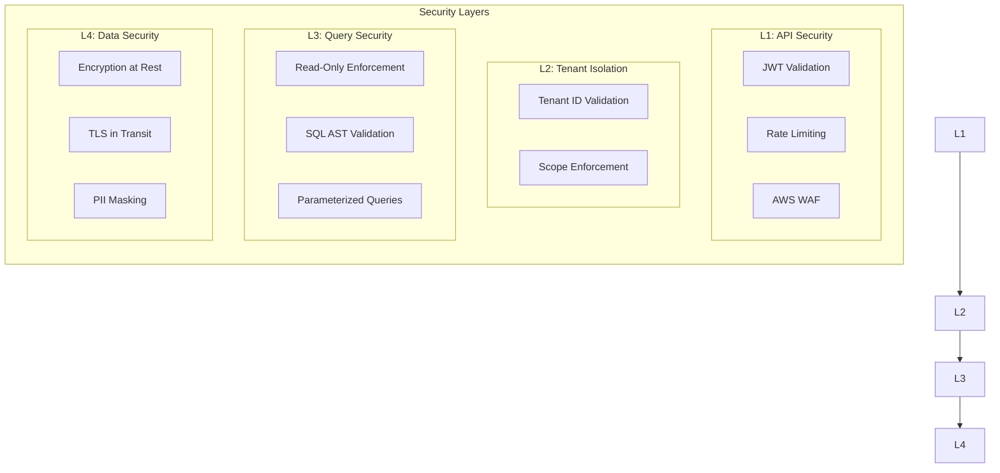
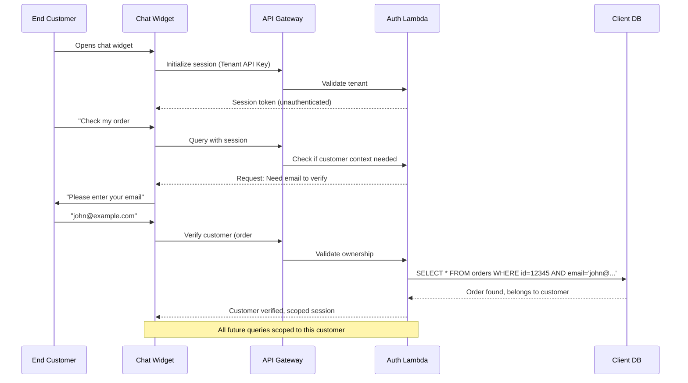
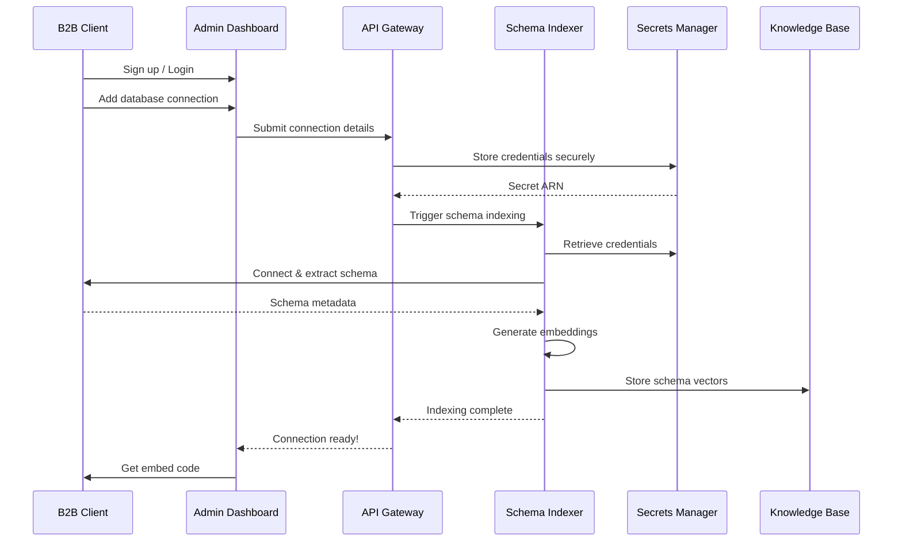
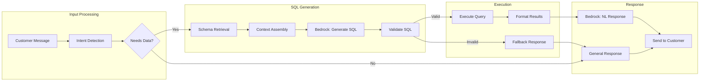

# B2B SaaS Customer Care AI - System Architecture

## Overview

An AI-powered customer care system that connects to B2B clients' databases, understands their schema, and answers end-customer queries by dynamically generating and executing SQL.

---

## High-Level Architecture

---

## Core Components Deep Dive

### 1. Text-to-SQL Engine (The Core Value)

This is the heart of the system. Here's how it works:

#### Key Design Decisions for Text-to-SQL:

| Decision | Options | Recommended | Rationale |
|----------|---------|-------------|-----------|
| **LLM Model** | DeepSeek R1 vs Claude 3 models | **DeepSeek R1** | Excellent reasoning capabilities for SQL generation |
| **Schema Retrieval** | Full schema vs RAG | **RAG** | Large schemas won't fit in context |
| **Query Generation** | Single-shot vs Multi-step | **Multi-step** | Complex queries need reasoning |
| **Validation** | Regex vs AST parsing | **AST parsing** | More reliable SQL validation |

---

### 2. Multi-Tenant Data Model

---

### 3. Security Architecture

#### Security Controls:

| Layer | Control | Implementation |
|-------|---------|----------------|
| **API** | Authentication | Cognito JWT for admin, API key + customer ID for widget |
| **API** | Rate Limiting | API Gateway throttling per tenant |
| **Tenant** | Isolation | Tenant ID in all queries, row-level security |
| **Query** | Read-Only | DB user with SELECT-only permissions |
| **Query** | SQL Injection | AST parsing, parameterized queries, keyword blacklist |
| **Query** | Scope Limiting | Customer can only query their own data |
| **Data** | Credentials | Secrets Manager with rotation |
| **Data** | Encryption | RDS encryption, S3 encryption |

---

### 4. Customer Authentication Flow

How does an end-customer prove they can access their order data?

#### Authentication Options:

| Method | Security Level | UX | Recommended For |
|--------|---------------|-----|-----------------|
| Order ID + Email | Medium | Simple | E-commerce |
| Magic Link (Email) | High | Extra step | Financial services |
| SSO Integration | Highest | Seamless | Enterprise clients |
| Order ID Only | Low | Simplest | Low-risk queries |

---

## AWS Services Mapping

| Component | AWS Service | Configuration |
|-----------|-------------|---------------|
| **API Layer** | API Gateway (HTTP API) | Custom domain, CORS |
| **Compute** | Lambda (Python 3.12) | 512MB-1GB memory, 30s timeout |
| **LLM** | Bedrock (DeepSeek R1) | us-east-1 (check region availability) |
| **Vector Store** | Bedrock Knowledge Base + OpenSearch Serverless | For schema RAG |
| **App Database** | RDS PostgreSQL (db.t4g.micro → db.r6g.large) | Multi-AZ for prod |
| **Secrets** | Secrets Manager | Auto-rotation enabled |
| **Static Assets** | S3 + CloudFront | Admin dashboard, widget JS |
| **Auth** | Cognito | User pools for B2B clients |
| **IaC** | SAM or CDK | Python CDK recommended |
| **Monitoring** | CloudWatch + X-Ray | Distributed tracing |

---

## Data Flow Diagrams

### Flow 1: New Client Onboarding

### Flow 2: Customer Query Processing

---

## Discussion Points

> [!IMPORTANT]
> Please review these architectural decisions and let me know your preferences:

### 1. Database Connectivity Approach

| Option | Pros | Cons |
|--------|------|------|
| **A: Direct Connection** | Simple, low latency | Requires client DB to be accessible |
| **B: Agent-Based** | Works with private DBs | More complex, client installs agent |
| **C: Data Sync** | Full control, works offline | Stale data, storage costs |

**Which clients will you target first?** (affects connectivity choice)

---

### 2. Customer Verification Strictness

For end-customers querying their data:
- **Lenient**: Order ID only (easy UX, lower security)
- **Moderate**: Order ID + Email (balanced)
- **Strict**: Email magic link or SMS OTP (high security)

**What level suits your target market?**

---

### 3. Query Complexity Support

| Level | Example Query | Complexity |
|-------|---------------|------------|
| **Simple** | "Where is my order?" | Single table lookup |
| **Medium** | "Show my order history for last 3 months" | Joins, date filtering |
| **Complex** | "Which of my orders had the fastest delivery?" | Aggregations, comparisons |

**Should MVP support all levels, or start simple?**

---

### 4. Fallback Strategy

When the AI can't answer:
- **A**: "I don't know" + suggest contacting support
- **B**: Escalate to human agent (requires integration)
- **C**: Create support ticket automatically

**What's your preferred fallback?**

---

## Next Steps After Approval

Once we align on the architecture, I'll create:

1. **SAM/CDK Project Structure** - Infrastructure as Code
2. **Text-to-SQL Lambda** - Core engine with Bedrock
3. **Local Testing Setup** - Mock database for development
4. **Schema Indexer** - For RAG-based retrieval

---

Let me know your thoughts on the discussion points above, and we can refine the architecture before implementation!
